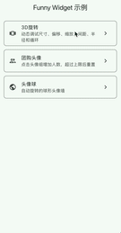
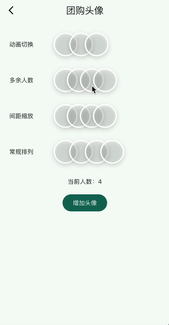
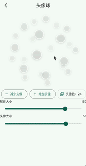

# funny_widget

`funny_widget` provides a small set of animated Flutter widgets:

- `GroupPurchaseAvatar` for overlapping avatar stacks with optional count labels and fixed-window autoplay.
- `AvatarSphereWidget` for draggable, auto-rotating spherical avatar walls.
- `Swiper3DWidget` for touch-driven 3D carousel layouts with controller support.

[](https://pub.dev/packages/funny_widget)





## Installation

```yaml
dependencies:
  funny_widget: ^0.0.1
```

## Usage

```dart
import 'package:flutter/material.dart';
import 'package:funny_widget/funny_widget.dart';

class AvatarStackExample extends StatelessWidget {
  const AvatarStackExample({super.key});

  @override
  Widget build(BuildContext context) {
    return GroupPurchaseAvatar(
      avatars: const [
        'https://picsum.photos/seed/funny-widget-1/80/80',
        'https://picsum.photos/seed/funny-widget-2/80/80',
        'https://picsum.photos/seed/funny-widget-3/80/80',
        'https://picsum.photos/seed/funny-widget-4/80/80',
      ],
      size: 48,
      maxVisibleCount: 3,
    );
  }
}
```

```dart
class AvatarSphereExample extends StatelessWidget {
  const AvatarSphereExample({super.key});

  @override
  Widget build(BuildContext context) {
    return Center(
      child: AvatarSphereWidget(
        avatarUrls: const [
          'https://picsum.photos/seed/funny-widget-a/80/80',
          'https://picsum.photos/seed/funny-widget-b/80/80',
          'https://picsum.photos/seed/funny-widget-c/80/80',
          'https://picsum.photos/seed/funny-widget-d/80/80',
          'https://picsum.photos/seed/funny-widget-e/80/80',
          'https://picsum.photos/seed/funny-widget-f/80/80',
        ],
        radius: 140,
        avatarSize: 56,
      ),
    );
  }
}
```

```dart
final controller = Swiper3DController();

Swiper3DWidget(
  controller: controller,
  childWidth: 120,
  childHeight: 80,
  onPageChanged: (page) {},
  children: const [
    ColoredBox(color: Colors.red),
    ColoredBox(color: Colors.green),
    ColoredBox(color: Colors.blue),
  ],
);
```

See the `example/` app for interactive demos of every widget.
